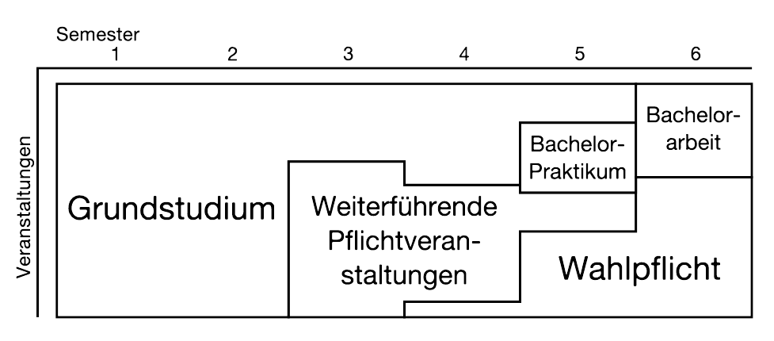
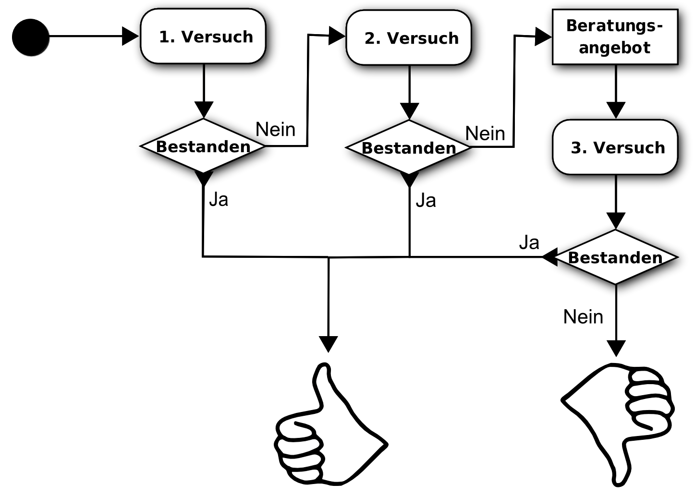

# Die Ordnung des Studiengangs

**Die Ordnung deines Studiengangs beschreibt, wie dein Studium organisiert ist. Sie besteht aus den Ausführungsbestimmungen zu den Allgemeinen Prüfungsbestimmungen, dem Studien- und Prüfungsplan, den Kompetenzbeschreibungen und dem Modulhandbuch.**

Die folgenden Angaben sind wie immer ohne Gewähr. Verbindlich sind nur die offiziellen Versionen der Ordnung, der Allgemeinen Prüfungsbestimmungen und die Informationen der (Fach-)Studienberatung beziehungsweise des Dekans, der Dekanin oder des Studiendekans bzw. der Studiendekanin.

## Vorbemerkung
Zum erfolgreichen Abschluss des Bachelorstudiengang musst du mindestens 180 Credit Points (CP) gemäß der Ordnung erbringen. Nach dem Abschluss des Bachelors erwirbst du dann den akademischen Grad Bachelor of Science (B. Sc.).

## Studienziele
Dein Studium umfasst sowohl mathematisch-naturwissenschaftliche als auch ingenieurwissenschaftliche Aspekte. Du sollst lernen, selbstständig zu arbeiten. Dazu gehört die Fähigkeit, Problemlösungen zu finden und deren Auswirkungen und Konsequenzen abschätzen zu können, ebenso die Weiterentwicklung, Anpassung oder Verwertung dieser Lösungsansätze. Des Weiteren soll dir dein Studium einen Einblick in die Arbeits- und Berufswelt geben und du sollst die Verantwortung und Stellung als Informatikerin oder Informatiker in der Gesellschaft kennen lernen.

Um das alles zu erreichen, bedarf es unter anderem an:

* einer Basis an wissenschaftlichen Methoden der Informatik und der Mathematik
* fachübergreifendem Denken
* der Kenntnis und Fähigkeit, methodisch komplexe Softwaresysteme zu realisieren
* kritischer Reflexion und Argumentation über Inhalte und Methoden der Informatik
* wissenschaftlichem Arbeiten mit dazugehörigem Vertrauen und Selbstständigkeit
* Kooperation, Kommunikation und Kreativität sowie Abstraktions- und Ordnungsvermögen
* der Bereitschaft zu gesellschaftlich verantwortlichem ingenieursmäßigem Handeln.

## Credit Points

Credit Points sind eine Aufwandsbewertung, um eine einheitliche Größe zum Vergleich des zeitlichen Umfangs mit anderen Veranstaltungen zu haben. Ein Credit Point entspricht etwa 30 Stunden Arbeit im Semester. Pro Semester soll ein Student oder eine Studentin ungefähr 30 Credit Points erwerben. Dies entspricht dem Aufwand einer 40-Stundenwoche bei einem Acht-Stunden-Tag.

## Mentorensystem

Im ersten Studienjahr (also innerhalb der ersten zwei Semester deines Studiums) hast du das Mentorensystem zu absolvieren. Über das Mentorensystem bekommst du für mindestens das erste Semester einen Mentor oder eine Mentorin an die Seite gestellt, dies sind höhersemestrige und speziell geschulte Studierende.

## Abschnitte

<!-- /img/studienuebersicht -->

Das Bachelorstudium der Informatik an der TU Darmstadt gliedert sich in drei Abschnitte. Am Anfang steht das Grundstudium mit einer Reihe von Pflichtveranstaltungen, in denen die Grundlagen der Informatik und der Mathematik vermittelt werden. Daran schließen sich die weiterführenden Pflichtveranstaltungen an, die in Teilbereiche der Informatik einführen. Im Wahlpflichtbereich kannst du dich in einige dieser Bereiche vertiefen.

## Die Grundveranstaltungen

* **Funktionale und objektorientierte Programmierung:**  
  Anfänge der funktionalen und objektorientierten Programmierung
* **Algorithmen und Datenstrukturen:**  
  Sortieralgorithmen, Graphen, Listen und Bäume, ...
* **Betriebssysteme:**  
  Einstieg in Betriebssysteme, Speicherverwaltung, Scheduling, ...
* **Einführung in den Compilerbau:**  
  Aufbau eines Compilers, Laufzeiten, Semantische Analyse,...
* **Systemnahe und parallele Programmierung:**  
  Programmiersprachen für systemnahe Programmierung, Grundlagen paralleler Systeme und Architekturen,...
* **Automaten, formale Sprachen und Entscheidbarkeit:**  
  Einführung: Transitionssysteme, Wörter, Sprachen, Mathematische Grundbegriffe und elementare Beweismethoden, Automatentheorie,...
* **Aussagen- und Prädikatenlogik:**  
  Syntax und Semantik der Aussagenlogik und der Prädikatenlogik, funktionale Vollständigkeit, Normalformen, vollständige Beweiskalküle
* **Formale Methoden im Softwareentwurf:**  
  Systemeigenschaften und deren Verifikation
* **Mathe 1:**  
  Grundlagen der Mathematik und Lineare Algebra
* **Mathe 2:**  
  Analysis und Einführung in Differentialgleichungen
* **Mathe 3:**  
  Numerik, Stochastik und Statistik
* **Digitaltechnik:**  
  Digitaltechnik, kombinatorische und sequentielle Hardware/Schaltungen, Hardware-Description-Languages (HDL), digitale Schaltungen
* **Rechnerorganisation:**  
  Architektur von Mikroprozessoren, Mikroarchitektur, Speicher

## Die weiterführenden Pflichtveranstaltungen

* **Software Engineering:** Sprachen/ Methoden/Werkzeuge, Entwicklungsmodelle, Design Patterns
* **Computersystemsicherheit:** Sicherheit und Zuverlässigkeit von Systemen, Verschlüsselung
* **Architekturen und Entwurf von Rechnersystemen:** Mikroelektronische Systeme/eingebettete Systeme, Systemprogrammierung
* **Modellierung, Spezifikation und Semantik:** formale Modellierung von Programmiersprachen, verhaltensorientierte Modellierung von Systemen
* **Computational Engineering &amp; Robotik:** Simulation und Konstruktion, Robotik und Hochleistungsrechnen
* **Informationsmanagement:** Datenbanken, Informationsgewinnung, Vernetztes Wissensmanagement
* **Computernetzwerke und verteilte Systeme:** OSI-Schichtenmodell, Rechnernetze und verteilte Systeme
* **Visual Computing:** Graphische und multimodale interaktive Systeme, E-Learning

Die weiterführenden Pflichtveranstaltungen umfassen insgesamt 40 Credit Points (CP).

## Wahlpflichtbereich

Der Wahlpflichtbereich besteht aus drei Bereichen, die in der Summe 33 CP ergeben müssen.

* 12-18 CP Vorlesungen, Übungen oder integrierte Lehrveranstaltungen aus sechs Themengebieten, wobei nicht mehr als 9 CP aus einem Gebiet kommen dürfen.
* 12-15 CP aus Praktika (min. 1), Praktikum in der Lehre (max. 1) und Seminar (1-2).
* 3-6 CP aus fachübergreifenden Veranstaltungen.

## Bachelorpraktikum

Im Bachelorpraktikum werden die in anderen Veranstaltungen erworbenen Fähigkeiten zur Durchführung eines Softwareprojekts praktisch angewendet. Das Praktikum selbst hat 6 CP, die zugehörige Projektbegleitung 3 CP.\\

## Bachelorarbeit

Die Bachelorarbeit stellt den "krönenden Abschluss" deines Studiums dar – oder den Abschluss des ersten Abschnitts, solltest du dich für ein Master-Studium interessieren. Sie hat 12 CP. Ihr Thema findest du in der Regel durch Aushänge der Fachgebiete. In Absprache mit dem bzw. der Professor\*in, der bzw. die dich betreut, ist es aber auch möglich, selbst ein Thema vorzuschlagen. Die Bachelorarbeit hat eine reine Bearbeitungszeit von 360 Stunden und soll in einem Zeitraum von sechs Monaten fertiggestellt werden. Das Ziel der Bachelorarbeit ist, dass du (mit Betreuung) in der Lage bist, ein Problem aus der Informatik selbstständig in vorgegebener Zeit zu bearbeiten und die Ergebnisse verständlich darzustellen. Neben der schriftlichen Arbeit gehört dazu auch eine Präsentation dieser Ergebnisse mit anschließender Befragung und Diskussion.

## Zulassungsvoraussetzungen

Alle Lehrveranstaltungen des ersten Studienjahres haben Zulassungsvoraussetzungen. Das sind

* *Funktionale und Objektorientierte Programmierkonzepte* und *Algorithmen und Datenstrukturen*
* *Digitaltechnik* und *Rechnerorganisation*
* *Automaten, Formale Sprachen und Entscheidbarkeit* und *Aussagen- und Prädikatenlogik* sowie
* *Mathe 1* und *Mathe 2*

Um an den Prüfungen dieser Veranstaltungen teilnehmen zu können, musst du erst eine Zulassung erhalten. Wie du diese Zulassung bekommst, legen die Veranstalterinnen und Veranstalter zu Beginn der Lehrveranstaltung fest. Du kannst beliebig oft versuchen, diese Zulassungsvoraussetzung zu erwerben, denn es gibt hier keine Beschränkung der Wiederholungen.

## Studienleistungen

Studienleistungen kannst du, genauso wie Zulassungsvoraussetzungen, beliebig oft wiederholen, bis du sie bestanden hast. Im Bachelor- und Masterstudiengang sind z.B. Seminare und Praktika solche Studienleistungen.

## Fachprüfungen

Fachprüfungen unterscheiden sich von Studienleistungen in ihrer Wiederholbarkeit. Fachprüfungen können nur zweimal wiederholt werden. Das heißt, dass du für jede Veranstaltung, die du mit einer Fachprüfung abschließen musst, nur drei Versuche zum Bestehen hast. Wenn du bei zwei Versuchen durchgefallen bist, dann wirst du von der Studienberatung zu einem Beratungsangebot eingeladen (siehe Grafik).

Fachprüfungen im Grundstudium sind meistens schriftlich, im Wahlpflichtbereich können sie ebenfalls schriftlich, aber auch mündlich sein. Für Fachprüfungen muss man sich, genau wie für Studienleistungen, anmelden. Dies geschieht online im TUCaN-System (<https://www.tucan.tu-darmstadt.de>, siehe auch den letzten Abschnitt).

Als Sonderform der Fachprüfung gibt es vorlesungsbegleitende Fachprüfungen, in denen die Fachprüfung schon in der Vorlesungszeit des Semesters abgeleistet werden muss, zum Beispiel durch zwei Teilklausuren.

Prüfungen finden (von wenigen Ausnahmen abgesehen) in der vorlesungsfreien Zeit statt. Spezielle Prüfungszeiträume, in denen alle Prüfungen stattfinden, gibt es in deinem Studium nicht.

## Gesamtnote

Für die Gesamtnote deines Studiums wird eine Durchschnittsnote berechnet. Dabei werden Grundstudium und weiterführende Pflichtveranstaltungen jeweils einfach, Wahlpflichtbereich, Bachelorarbeit und Bachelorpraktikum dreifach gewichtet.

## Die Fortsetzung: Master

Absolventinnen und Absolventen des Bachelorstudiengangs können direkt in das Berufsleben einsteigen, oder ihrem bisherigen Studium noch einen Masterstudiengang anhängen. Letzteres ist sinnvoll, um die im Bachelor erworbenen Grundlagen durch vertiefende Veranstaltungen zu ergänzen. Diese Vertiefung muss nicht zwingend im Master Informatik oder einem der Informatik-Spezialisierungsmaster an der TU Darmstadt erfolgen, sondern kann auch in verwandten Studiengängen, an anderen Universitäten oder sogar im Ausland erbracht werden. Wie der Master im Detail organisiert ist, kann in den Ordnungen der Masterstudiengänge nachgelesen werden.

Bis zu 30 CP können aus dem Master während des Bachelorstudiums "vorgeprüft" werden, um einen Leerlauf am Ende des Bachelors zu vermeiden. Diese vorgezogenen Leistungen müssen als solche angemeldet werden, und werden (inklusive aller Fehlversuche) im Master angerechnet.

## TUCaN: Studiengangsordnung digital

Seit dem Wintersemester 2010/11 gibt es an der TU Darmstadt TUCaN. Dort ist die Ordnung deines Studiengangs digital hinterlegt, mit all ihren hier beschriebenen Regeln. Das Wichtigste für dich: In TUCaN meldest du dich für die Prüfungsleistungen an und ab!

*Ingo Reimund und Thomas Pilot, überarbeitet von Stefan Gries und Tobias Otterbein. Für die 2015er Ordnung überarbeitet von Stefan Pilot*
