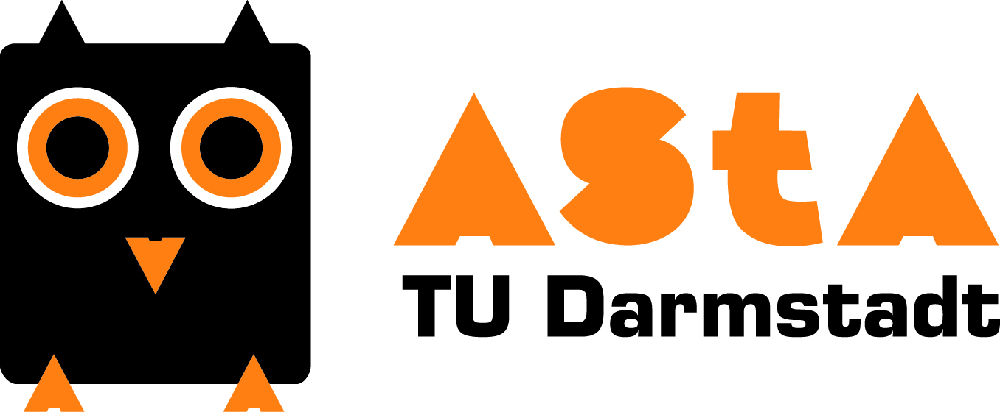

# Der AStA der TU Darmstadt

**Der Allgemeine Studierendenausschuss (AStA) ist die oberste Vertretung aller Studierenden auf Universitätsebene. Darüber hinaus ist er Ansprechpartner bei Problemen und bietet für Studierende etliche Service- und Beratungsangebote.
Wer der AStA eigentlich ist und was er alles so macht, erfährst du im folgenden Artikel.**

### Aufgaben des AStA
Die Aufgaben des AStA sind vielfältig und leiten sich aus den Aufgaben der Studierendenschaft ab, die nach §3 der Satzung der Studierendenschaft definiert sind:

*	Die Vertretung der Gesamtheit ihrer Mitglieder im Rahmen ihrer gesetzlichen Befugnis.
*	Die Wahrnehmung der hochschulpolitischen Belange ihrer Mitglieder.
*	Die Wahrnehmung der wirtschaftlichen und sozialen Belange der Student\*innen. Die Zuständigkeit des Studierendenwerkes (StuWe) oder anderer Träger bleibt unberührt.
*	Die Pflege überregionaler und internationaler Studierendenbeziehungen.
*	Die Förderung der politischen Bildung und des Verantwortungsbewusstseins von Student\*innen für ihre Rolle als Staatsbürger\*innen. Hierzu gehört auch die Förderung eines wissenschaftlich fundierten, kritischen Verständnisses der Student\*innen von ihrer jetzigen und künftigen Tätigkeit und der Rolle von Wissenschaft und Technik in der Gesellschaft.
*	Die Unterstützung kultureller und musischer Interessen der Student\*innen.

Das mag erst einmal alles sehr förmlich und theoretisch klingen, doch tatsächlich arbeiten täglich AStA-Referentinnen und -Referenten daran, die Studienbedingungen an der TU zu verbessern. Der AStA engagiert sich zum Beispiel für Studierende in sozialen Notsituationen und steht im ständigen Kontakt mit der Universitätsleitung. Er sorgt mit seinen Gewerben und Veranstaltungen für mehr Kulturangebote in Darmstadt und ist zum Beispiel auch dafür verantwortlich, dass es das Semesterticket in seiner jetzigen Form überhaupt gibt.
Du siehst also: Der AStA hat durchaus auch Einfluss auf deinen Studienalltag.

### Doch wie kommt man eigentlich in den AStA?

Der AStA besteht größtenteils aus Referenten und Referentinnen, die jedes Jahr vom Studierendenparlament gewählt werden. Neben diesen gewählten Referaten gibt es inzwischen auch viele eingestellte Referate, die von engagierten Studierenden geleitet werden, die mit einem tollen Projekt zum AStA gekommen sind und dann für ihr jeweiliges Referat eingestellt wurden.

Aktuell gibt es zum Beispiel Referate zum Thema: Nachhaltigkeit, Queer, Feminismus, Mobilität, Inklusion, Familienförderung und noch vieles mehr.

## Angebote des AStA im Detail:

Neben dem politischen Engagement ist der AStA wie eingangs schon erwähnt für viele Servicangebote zuständig. Hier eine kleine Auswahl:

### Fahrradverleihsystem Call a Bike

Für alle Darmstädter Studierenden ist beim Leihfahrradsystem "Call a Bike" der Deutschen Bahn jeweils die erste Stunde jeder Fahrt kostenlos. Und das auch noch deutschlandweit! Die Räder können ganz einfach an einer Station entliehen und an einer beliebigen anderen Station zurückgegeben werden. In Darmstadt gibt es inzwischen über 30 Stationen und eine liegt direkt am Piloty. Mehr zum Angebot [hier][1].

### RMV-AStA Semesterticket

Dein Studienausweis ist gleichzeitig dein Semesterticket und bietet kostenlose Fahrten mit dem öffentlichen Nahverkehr im gesamten RMV-Gebiet und teilweise auch im Übergangsgebiet (siehe Grafik [hier](./semesterticket.md)). Die Konditionen für dieses Ticket verhandelt regelmäßig der AStA und er ist auch dein Ansprechpartner bei allen Fragen um das Ticket (z.B. Ticket-Erstattung bei Auslandssemestern). Mehr [hier][2].

### Book-n-Drive Carsharing

Der AStA der TU Darmstadt hat eine Kooperation mit dem Carsharing-Anbieter book-n-drive vereinbart. Carsharing über book-n-drive ermöglicht im Rhein-Main-Gebiet die Nutzung von über 800 Fahrzeugen, vom Cabrio bis zum Transporter, insbesondere auch für kurze Fahrten. Dabei können Fahrzeuge online oder telefonisch über book-n-drive reserviert werden. Wenn ihr losfahren wollt, wird das Auto mit eurer Book N Drive Karte geöffnet. Über den Verbund mit anderen Carsharing-Anbietern (z.B. flinkster) ist auch die Nutzung in anderen Städten möglich. Mehr [hier][3]

### AStA-Büros

Die AStA-Büros in der Stadtmitte (S1|03-62) und auf der Lichtwiese (L3|01-70) sind deine erste Anlaufstelle, wenn du Fragen zum AStA, den Angeboten oder auch generell zu Geschehnissen in der Universität hast. Auch wenn du dich selbst gerne einbringen würdest oder ein Projekt starten willst, bist du hier richtig. Lagebeschreibung und Öffnungszeiten [hier][4].

### Beratungsangebote
Der AStA organisiert und vermittelt kostenlose Erstberatung zu vielen verschieden Themen. Im Detail sind dies derzeit die BAföG- und Sozialberatung, die Rechtsberatung durch erfahrene Anwälte, die Mietrechtsberatung, die Arbeitsrechtsberatung in Zusammenarbeit mit dem DGB und die Sprechstunde für internationale Studierende. Wenn du nicht genau weißt, an welche der vielen Beratungsstellen du dich eigentlich mit deinem Problem wenden sollst, dann frag am Besten einfach mal in einem der AStA-Büros nach. Infos und aktuelle Sprechzeiten findest du [hier][5].

### Kultur-Kooperationen
Aus dem Semesterbeitrag gehen 0,50 &euro; an das Staatstheater Darmstadt. Dafür hat jede\*r Studierende die Möglichkeit, kostenlos Restkarten für Theater, Konzerte, Ballett, Opern oder Musicals im Staatstheater zu bekommen. Wie es geht, steht [hier][6].

### Studentische Gewerbe
Neben den Serviceangeboten ist der AStA auch zuständig für eine Vielzahl an Gewerben, welche größtenteils von Studierenden verwaltet werden. Direkt auf dem Campus Stadtmitte findet man das neu eröffnete Kulturcafé 806qm und die Fahrradwerkstatt 20&deg;. Dazu kommen noch der Schlossgarten (der Biergarten auf der Bastion des Schlosses) und der Nachtclub Schlosskeller, der für seine Musik abseits des Mainstream bekannt ist. Auf dem Campus Lichtwiese betreibt der AStA außerdem einen Papierladen.

Alle weiteren Infos rund um den AStA und dessen weitere Angebote findest du auf der [AStA-Homepage][7].

*Julian Haas, Tobias Kratz*

[1]: https://www.asta.tu-darmstadt.de/asta/de/angebote/call-a-bike
[2]: https://www.asta.tu-darmstadt.de/asta/de/angebote/semesterticket
[3]: https://www.asta.tu-darmstadt.de/asta/de/angebote/carsharing
[4]: https://www.asta.tu-darmstadt.de/asta/de/angebote/bueros
[5]: https://www.asta.tu-darmstadt.de/asta/de/angebote/beratung
[6]: https://www.asta.tu-darmstadt.de/asta/de/angebote/staatstheater
[7]: https://www.asta.tu-darmstadt.de
