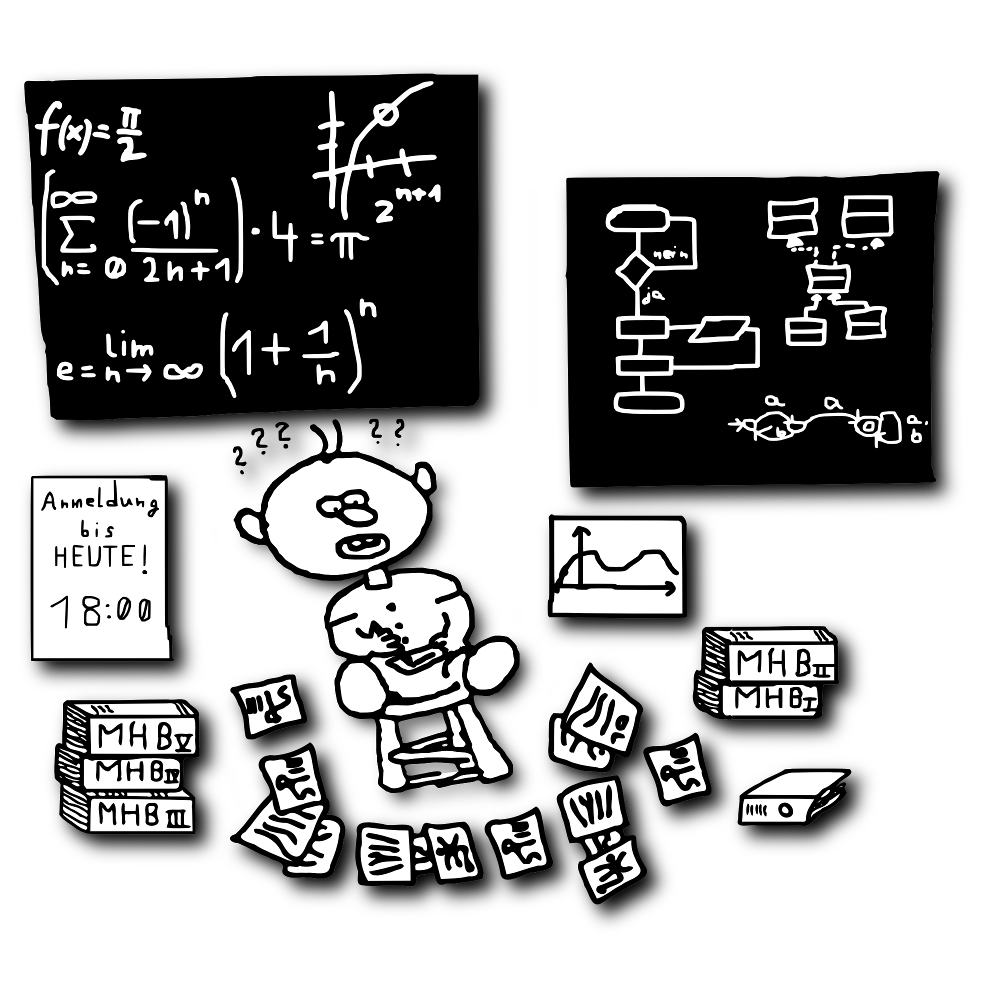

# Die Universität

> Sollen sich auch alle schäamen, die gedankenlos sich der Wunder der Wissenschaft bedienen, und nicht mehr geistig davon erfasst haben als die Kuh von der Botanik der Pflanzen, die sie mit Wohlbehagen frißt
>
> &mdash; *Albert Einstein (1879 - 1955), deutsch-US-amerikanischer Physiker, 1921 Nobelpreis für Physik*

